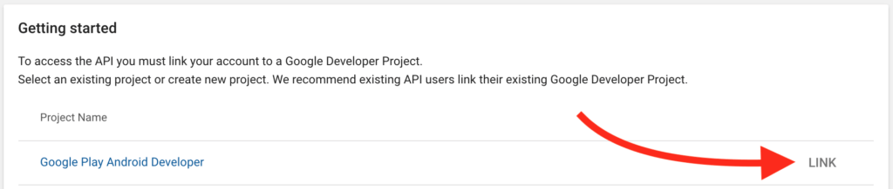
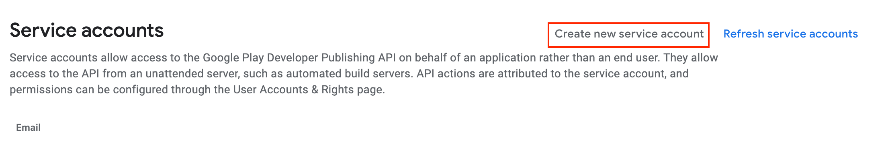
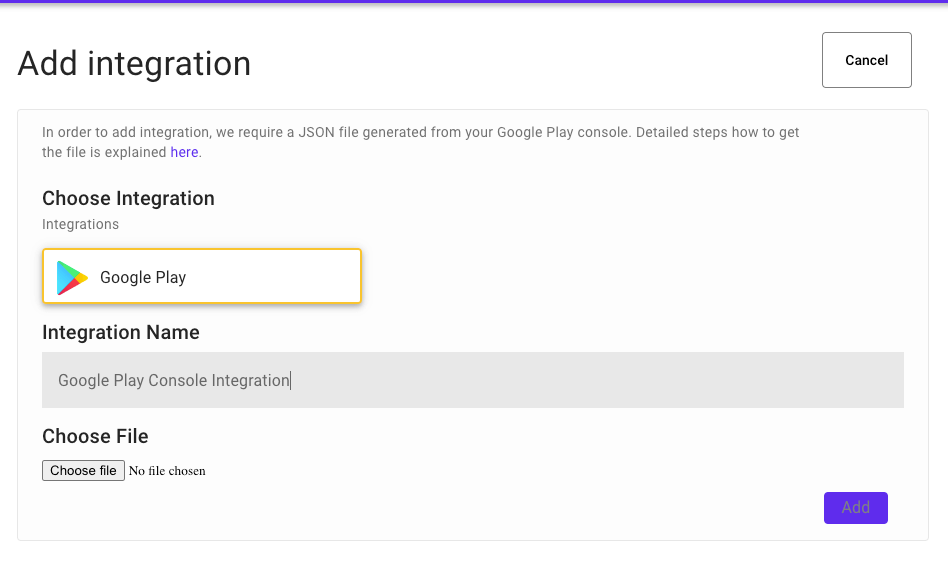
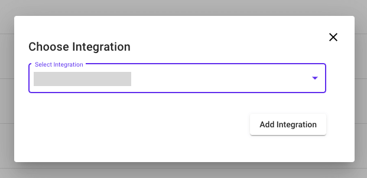

# Google Play Integration

Aim of the Play Store Developer API integration is to allow app owners have more control over the Play store review data. Two important capabilities after API integration are:

-   Ability to fetch recent reviews with direct API call and specify desired language to see these reviews in.
-   Ability to reply to reviews directly from Applysis platform.

In order to integrate Applysis to Google Play Console we need to get one single JSON file format from Google Play Console. All required steps below describe how to achieve that.

**There are two main steps:**

-   [Generate JSON file from Google Play Console](#generate-json-file-from-google-play-console)
-   [Integrate Generated JSON with Applysis](#integrate-generated-json-with-applysis)

##### Generate JSON file from Google Play Console

You need to setup Google Play Console service account and then you will be able to generate the JSON file from this account. In order for Applysis to access Developer API, the service account needs to be set up in [Google Play Console](https://play.google.com/console). Here are the steps needed to do so:

1.  Log in to your Google Play Console.
2.  Select **All apps > Settings > Developer account > API access.**
    
3.  From the Getting started section, click **Link** to connect a Google Developer Project. (or **Create a New Project** if none are listed)
    
4.  From the same API access screen, select **Create new service account.**
    
5.  You are shown a link to the **Google Cloud Platform**, follow it.
6.  From there, **\+ Create Service Account.**
    
7.  Fill in the form (set name and description to whatever suits you)
    -   Select the Role: **Project > Browser**
    -   Then click **Continue**
    -   You can skip **Grant users access to this service account**
    -   Click **Done**
8.  Click the created Service account
9.  Click **ADD KEY** and then **Create new key**
    
10. Select key type JSON.
    
11. Click **‘Create’. You should then get a message telling you ‘Private key saved to your computer’ and the private key should begin downloading. Click ‘Close’ on the dialog, then click ‘Done’ on the page.** (Clicking the Done button on the dialog back in your developer console will refresh the page and show you what has changed).
12. You can now close the Google Cloud Console and come back to the Play Console. Click the **Grant Access** button next to the newly created Service Account.
    
13. Select Account permissions tab and check View app information and Reply to reviews permissions. Click Invite User and Send Invite invite once the popup is shown.

    
    

At this stage we have generated the JSON file which should be uploaded to Applysis to have the ability to manage your reviews.

##### Integrate Generated JSON with Applysis

Once the JSON file is generated you can now already start integration.

1.  Open Applysis platform and and navigate to [Integrations](https://app.applysis.io/integrations).

2.  On Integrations tab click the **Add integration** button.

    

3.  Upload the [generated JSON file](#generate-json) from Google Play Console and name the integration, e.g Google play console integration

    

4.  Once submitted you should see the newly added integration already in the list of Google Play Integrations.

    

5.  Navigate to [Sources](https://app.applysis.io/sources) page.

6.  Find the Android application which belongs to your account and click three dots on the right side of it and then select: **Connect integration**

    

7.  In the dropdown select the integration from your integration list and click **Add integration**.

    

Congrats! 🎉 You have integrated your account with Applysis. Now you can go to [Reviews](https://app.applysis.io/reviews) page and already start replying to your beloved customers! 🎉

If you encounter any problems, please [send us an note](mailto:contact@applysis.io), we will be in touch soon.
