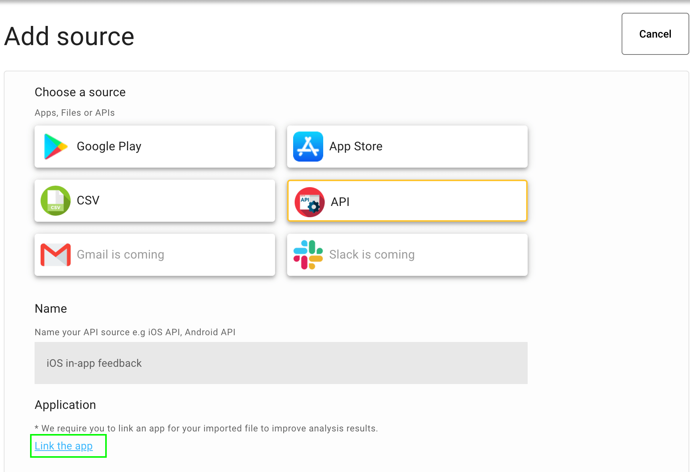
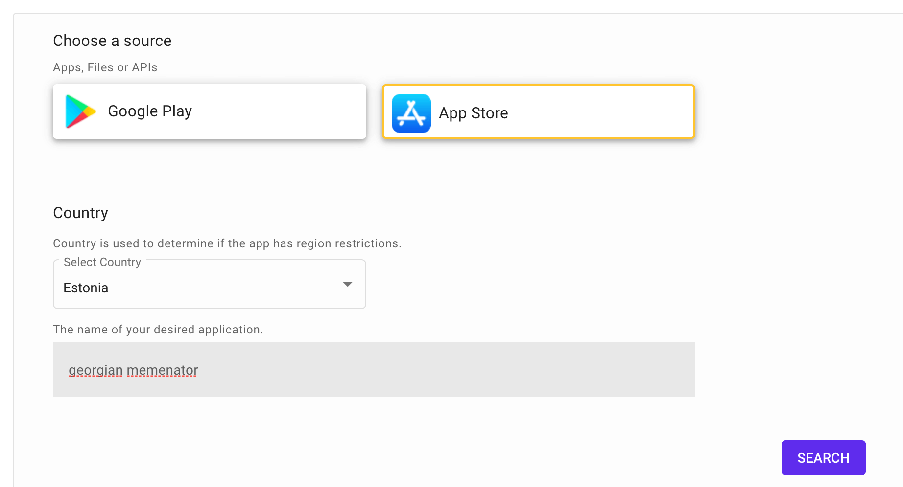
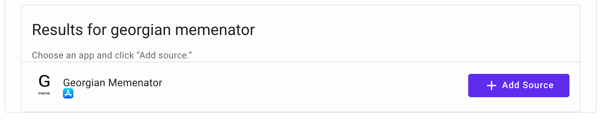
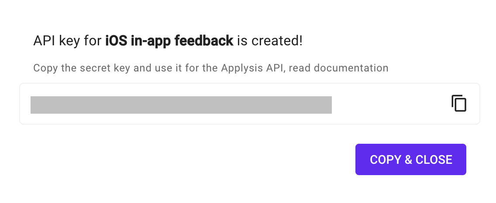

# Create API Source

Applysis provides API which gives the businesses or developers to submit feedbacks from their own software systems, it can be mobile in-app feedback, website widget etc.

Here are few steps how to create API source on Applysis platform.

1. Go on [Sources](https://app.applysis.io/sources) page.
2. Click **Add Source** button.
3. Choose **API** from the sources type.
4. Enter the name of the source e.g iOS in-app feedback.
5. In order to perform analysis better we require you to link your API source with your mobile application. So click **Link the app**.
   
6. When popup appears, select the Apple or Google store.
7. Select the country.
8. Enter the app name.
9. Click search. 
10. Once search is over, you have to click **Add Source** for the desired app to link. 
11. Now you can click **Create** the source.
12. API key will be generated. You can copy it for now. 

Well done! Your API Source is created! 🎉

No you can use this **api key** and submit feedback from any system your company requires. If you encounter any problems, please [send us an note](mailto:contact@applysis.io), we will be in touch soon.
