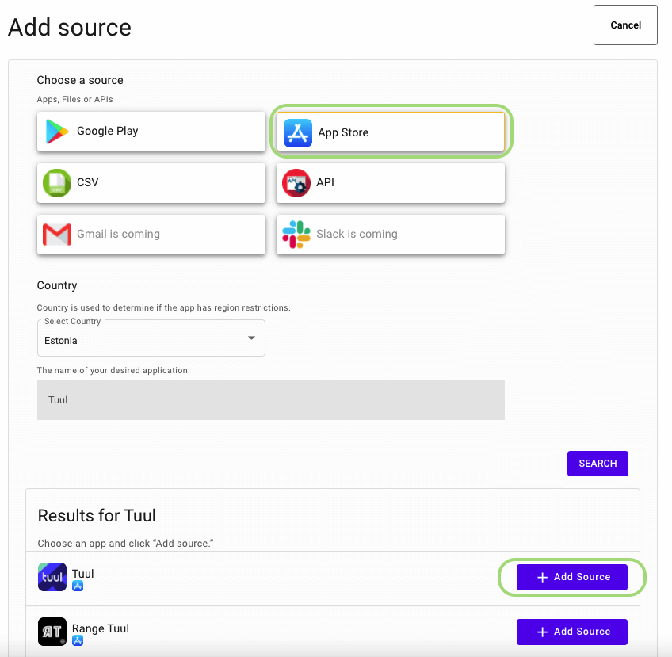

# Add iOS source

For adding iOS source **no integration is needed**. Follow simple steps.

1. Visit [Sources](https://app.applysis.io/sources) page.
2. Click **Add Source** button.
3. Select App Store.
4. Select country where the application is live.
5. Enter the app name.
6. Click **Search**.
7. Once search results are visible, click "Add Source" button.

