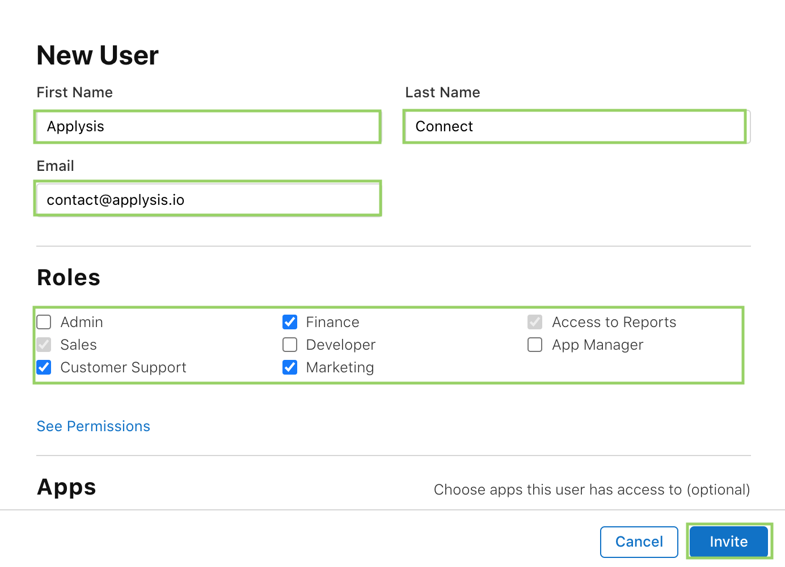
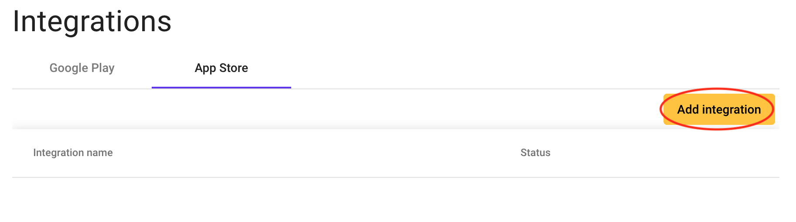
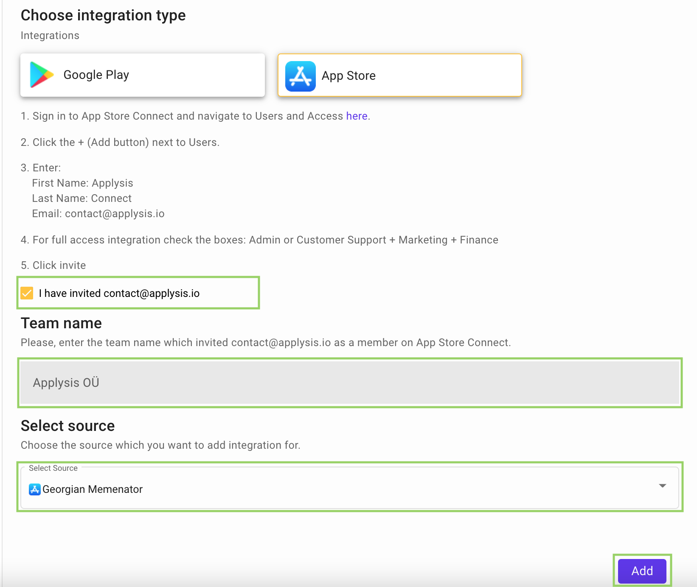

# Appstore Connect Integration

Aim of the Appstore integration is to allow app owners to reply to the reviews from Applysis directly:

##### Steps for Integration

1.  Before we add integration to Applysis, at first you should invite contact@applysis.io in your development account.So, navigate to [AppStore Connect](https://appstoreconnect.apple.com/access/users) and click + (Add user) button.

2.  Enter:

    1.  First Name: Applysis
    2.  Last Name: Connect
    3.  Email: contact@applysis.io
    4.  For full access integration check the boxes: Admin or Customer Support + Marketing + Finance
    5.  **Click Invite**

    

3.  Now, open Applysis platform and and navigate to [Integrations](https://app.applysis.io/integrations).

4.  Navigate to AppStore tab and click **Add integration** button.

    

5.  Here you have to:

    1.  Check the checkbox.
    2.  Enter the AppStore development team name from which you invited us.
    3.  Select the app you want to integrate the appstore connect to.
    4.  **Click Add**

    

Congrats! 🎉 Now you can sit back, we will review your integration and will let you know once your integrations is approved. We need on average 36 hours to approve your integration.

If you encounter any problems, please [send us an note](mailto:contact@applysis.io), we will be in touch soon.
